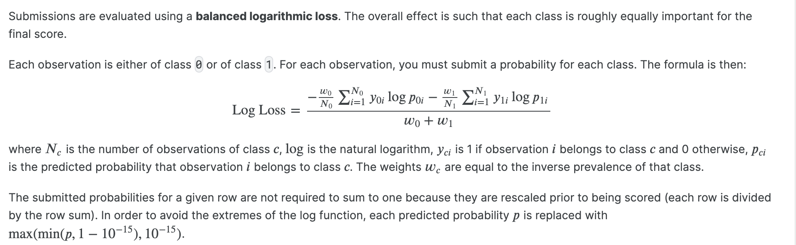

# ICR-Identifying-Age-Related-Conditions

A Kaggle Competition Link:
https://www.kaggle.com/competitions/icr-identify-age-related-conditions

## Context(directly copy pasted from kaggle):

They say age is just a number but a whole host of health issues come with aging. From heart disease and dementia to hearing loss and arthritis, aging is a risk factor for numerous diseases and complications. The growing field of bioinformatics includes research into interventions that can help slow and reverse biological aging and prevent major age-related ailments. Data science could have a role to play in developing new methods to solve problems with diverse data, even if the number of samples is small.

Currently, models like XGBoost and random forest are used to predict medical conditions yet the models' performance is not good enough. Dealing with critical problems where lives are on the line, models need to make correct predictions reliably and consistently between different cases.

Founded in 2015, competition host InVitro Cell Research, LLC (ICR) is a privately funded company focused on regenerative and preventive personalized medicine. Their offices and labs in the greater New York City area offer state-of-the-art research space. InVitro Cell Research's Scientists are what set them apart, helping guide and defining their mission of researching how to repair aging people fast.

In this competition, you’ll work with measurements of health characteristic data to solve critical problems in bioinformatics. Based on minimal training, you’ll create a model to predict if a person has any of three medical conditions, with an aim to improve on existing methods.

You could help advance the growing field of bioinformatics and explore new methods to solve complex problems with diverse data.

## Evaluation metric: 

TLDR: the lower the score, the better

## Experiements
The following performance are done on stratified train test(based on target) split with 20% test size.
In the description, it's being mentioned that XGBoost are previously used to predict medical conditions, so I will use that model as a control.

Using PCA:  
Logistic regression = 0.91  
SVM = 0.86  
XGBoost = 1.3658423341396895  
    

Without PCA:
Logistic regression = 0.79
 
SVM = 0.80
 
XGBoost = 0.59  
LightGBM = 0.65 

Realized that without PCA XGB boost actually does pretty well. Going to focus on correct variable selection methods/ merging different models. 
  

Ensemble XGBoost with LightGBM gives 0.57 score
  

But wait, we never optimized the parameters of these individual models. I'll optimize the parameters of models using optuna first.
  

XGBoost = 0.45975436175942636 {'learning_rate': 0.01596255039414685, 'max_depth': 7, 'n_estimators': 100}
 
LightGBM = 0.48372759400721 {'learning_rate': 0.05679604223386096, 'max_depth': 4, 'n_estimators': 100}
 
Ensemble them gives = 0.44558 which still seems pretty high. Will focus more on preprecossing. 
  

Standard scaler ensembles becomes = 0.43

 
Use KNN imputer instead of mean imputer +  standard scaler  becomes = 0.39

